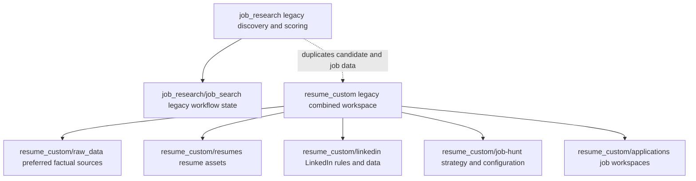

# Codebase Map

**Status:** Pre-migration baseline for restructuring 001
**Updated:** 2026-08-21

This map describes the repository as it exists before implementation. Planned
destinations are requirements, not current entry points, until the matching
plan and tasks are approved and executed.

## Current Dependency and Ownership Graph

## Current Module Ownership

| Area | Current responsibility | Entry points / important assets | Migration concern |
|---|---|---|---|
| `job_research/` | Greenhouse discovery, filtering, scoring, analysis, and generated job reports | top-level Python scripts, `jobs_master.csv`, `job_descriptions/` | hard-coded obsolete absolute paths; mixed source, canonical state, and generated output |
| `job_research/job_search/` | second job-search workflow with policies, templates, handoffs, and CSV state | `AGENTS.md`, `README.md`, `state/*.csv` | duplicated job/profile/rules sources; some unsupported candidate claims |
| `resume_custom/raw_data/` | detailed profile, education, experience, projects, research, skills, publications, and accomplishments | domain Markdown files | preferred factual evidence source, but fragmented and not yet normalized |
| `resume_custom/resumes/` | master, base, and tailored resume assets | LaTeX templates and generated PDFs | facts and transformation/rendering logic are not fully separated |
| `resume_custom/linkedin/` | LinkedIn profile, search, networking, and outreach material | Markdown, CSV, and YAML | LinkedIn-specific rules are mixed with generic messaging and facts |
| `resume_custom/job-hunt/` | role strategy, company research, search configuration, and pipeline notes | configuration YAML and many Markdown files | overlaps job research, tracking, applications, and outreach |
| `resume_custom/applications/` | per-job application workspace template | `TEMPLATE_COMPANY_TEMPLATE_ROLE/` | useful pattern but contains duplicated job/profile material |
| `resume_custom/archive/` | earlier superseded structure | `pre_restructure/` | must be preserved; contains ignored sensitive-looking environment copies |

## Current Public Entry Points

There is no stable package-level public interface. Automation is invoked through
standalone scripts. Migration 001 must preserve these working entry points and
behavior, changing code only for moved-path compatibility or verified duplicate
elimination. Any proposal for a new package-level interface belongs to a
separate post-consolidation refactor.

## Current Data Sources

| Data | Current location | Current status |
|---|---|---|
| Factual career source | `resume_custom/raw_data/` | preferred source pending canonical consolidation |
| Resume fact bank | `resume_custom/resume_fact_bank.yaml` | useful structured subset; incomplete |
| Discovered jobs | `job_research/jobs_master.csv` | 200 rows plus individual description files |
| Secondary job state | `job_research/job_search/state/jobs.csv` | 12 rows; partially overlaps master data |
| Application queue | `job_research/job_search/state/applications.csv` | 12 queued records; no verified submissions |
| Company/contact/outreach state | `job_research/job_search/state/*.csv` and `job_research/cohere_contacts/` | fragmented; contacts include duplicates and inferred email data |

## What Must Not Be Duplicated

- Verified career facts from the canonical profile source.
- The master job table and full job descriptions.
- Application lifecycle status.
- Contact identities and communication history.
- Resume templates and resume transformation rules.
- Job ranking policy or LinkedIn networking policy.

## Known Gaps

- Canonical directories and schemas do not yet exist.
- Historical path references point outside the current project root.
- Job records overlap without a migration ledger or stable cross-source merge.
- Generated reports contain candidate claims not supported by preferred factual
  sources.
- No repository validator, tests, or root dependency declaration exists yet.
  The root README currently documents the migration gate and must be updated to
  the implemented architecture during migration.
- A nested virtual environment and rebuildable clutter remain in the working
  directory but are ignored by Git pending approved cleanup tasks.
- Working automation has no formal regression suite, so consolidation must use
  focused before/after smoke checks and avoid opportunistic refactoring.

## Changelog

| Date | Change |
|---|---|
| 2026-08-21 | Constrained migration 001 to behavioral preservation; deferred interface redesign. |
| 2026-08-21 | Recorded audited pre-migration ownership and conflicts for spec 001. |
