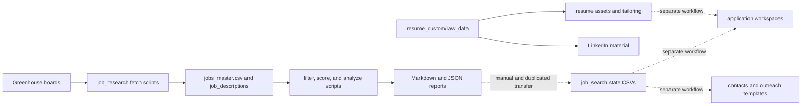
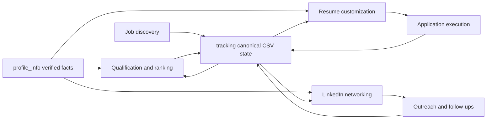

# System Workflow Map

**Status:** Current pre-migration workflow
**Updated:** 2026-08-21

## Current End-to-End Flow



The current repository does not implement one reliable pipeline. Discovery and
scoring operate separately from the newer evidence-controlled career material,
resume workspaces, and LinkedIn material. Some generated candidate profiles and
reports therefore contain unsupported claims and must not be reused as factual
input.

## Current Stage Descriptions

| Stage | Current owner | Input | Output | Limitation |
|---|---|---|---|---|
| Discover | `job_research/fetch_greenhouse*.py` | company boards | raw JSON, CSV, description files | hard-coded paths and overlapping script generations |
| Filter and score | `job_research/filter_jobs.py`, `score_jobs.py` | discovered jobs and embedded candidate assumptions | scored JSON/CSV and rankings | assumptions are not linked to verified canonical facts |
| Analyze | `job_research/analyze_market.py`, report scripts | scored jobs | Markdown and JSON reports | generated output is mixed with active source material |
| Track | `job_research/job_search/state/` | manually selected jobs | jobs, applications, companies, contacts, outreach CSVs | separate from `jobs_master.csv`; schema is incomplete |
| Tailor resume | `resume_custom/` | raw profile material, templates, job workspace | LaTeX/PDF and job-specific notes | reusable facts are not cleanly separated from resume logic |
| LinkedIn networking | `resume_custom/linkedin/` and legacy job-search templates | profile/job/company/contact material | searches, contacts, and message drafts | overlaps referral and generic outreach concerns |

## Required Target Flow for Migration 001

This target is not implemented yet; it defines the workflow boundary the
approved plan must realize. It is a logical ownership and data-flow view, not a
requirement to redesign the working implementations behind those stages.



## Master Pipeline (implemented, 2026-08-23)

The discovery→outreach spine of the target flow is now implemented and
validated end-to-end:

```
scripts/discovery_run.py   (L1 saved-search sweep, L2 recommended sweep,
                            career_ops scan, freshness tiers)
  → scripts/today_queue.py (review views: fresh_jobs / top_queue / needing_attention)
  → scripts/contact_discovery.py (ranked people per company registry)
  → scripts/connection_queue.py  (approve/send ledger: connection_requests.csv;
                                  poster_connect_sweep.py drives live sends)
```

All stages read/write canonical `tracking/` CSVs; the outreach ledger enforces
approve-before-send, record-sent-before-next-batch, ≤25/day cap, and the
never-contact-twice interlock with `contacts.csv` (see
`docs/rules/OUTREACH_RULES.md` §8 and `docs/rules/LINKEDIN_REFERRAL_RULES.md` §11–12).

## Changelog

| Date | Change |
|---|---|
| 2026-08-23 | Documented implemented master pipeline: discovery_run → today_queue → contact_discovery → connection_queue. |
| 2026-08-21 | Clarified that the target flow preserves working implementation behavior. |
| 2026-08-21 | Documented current split workflow and the spec-001 target boundary. |
